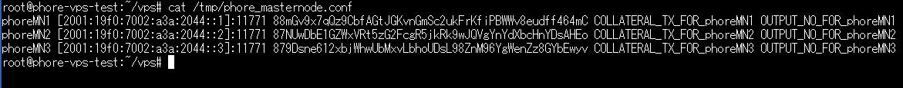

## How to use new features
- Add generate masternode private key feature
- Add masternode private key pre-input feature

When using this feature, you don't need to configure phore_n*.conf on the VPS anymore.

## How to use generate private key feature
1. Enter this command
```bash
git clone https://github.com/phoreproject/vps.git && cd vps && ./install.sh -p phore -g
```

2. Wait the script sets up your masternode.

3. Let's start your masternode client. Enter this command
```
activate_masternodes_phore
```
The masternode daemons will start and begin loading the Phore blockchain.

4. You need to check the masternode.conf created on the VPS. Enter this command:
```
cat /tmp/phore_masternode.conf
```

It will look similar to this:


Please copy that and paste it to your masternode.conf in local.
After this, you need to start from Step 1 of the installation procedure, but since you already generated the private key, you can skip step 2.

## How to use pre-input feature
1. Start From Step 1 of the installation procedure.
2. After completing Step 3, enter this command on VPS:
```bash
git clone https://github.com/phoreproject/vps.git && cd vps && ./install.sh -p phore --key **GENERATED PRIVATE KEY**
```
2. Wait the script sets up your masternode.

3. Let's start your masternode client. Enter this command:
```
activate_masternodes_phore
```
The masternode daemons will start and begin loading the Phore blockchain.

