# Slick masternode VPS setup for all your beloved crypto masternodes (Vultr example)


---
**PLEASE ALSO READ THE README**

Please also see the [README for this project](../README.md) that will give you a high-level overview of features. 

---

## Intro

This project started as handy bash script to setup my $PIVX masternodes in 2016 when there was almost zero documentation and anything that existed was either $DASH specific, sucked and in most cases both. For that reason, i started to work on a not-so-sucking way to install a lot of different masternodes with next to none manual intervention.

If you are not already aware, visit the project site and join the slack. The website at [https://pivx.org/](https://pivx.org/) is also well worth a visit. 


## Get a VPS system for your masternode(s)

I will use vultr for my instructions, but in practice and with a bit of tuning any hoster that gives you multiple free IPv6 addresses. Register / login with vultr.

Feel free to use my reflink to signup and receive a bonus w/ vultr:
<a href="https://www.vultr.com/?ref=6903922"></a>

It's also great that you can use Bitcoin to pay!

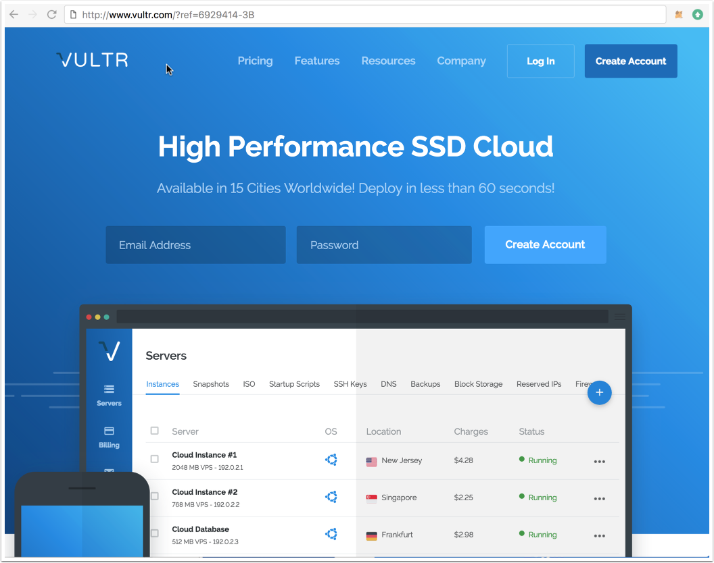

## Deploy a new system

First, create a new VPS by clicking that small "+" button.

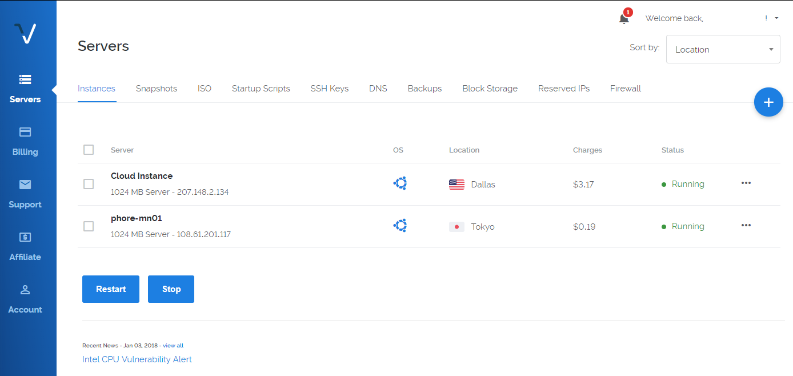

## Location choice

The location doesn't matter too much. If in doubt, choose a location next to you.

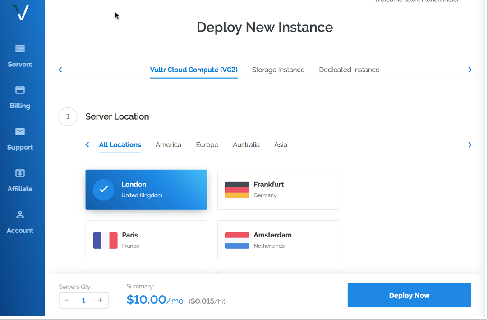

## Linux distribution (Ubuntu 16.04 LTS)

Select Ubuntu 16.04, i am mostly testing for that version.

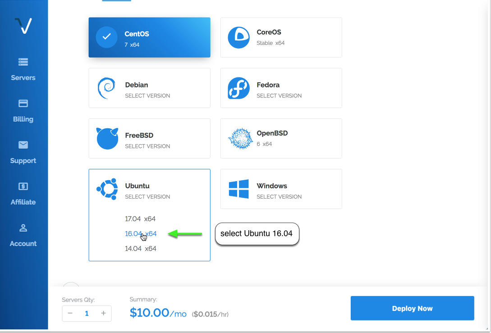

## VPS size

A decent masternode needs a bit of RAM and some storage space. The $5 instance is good enough for up to 5 masternodes. I recommend not running more than 3 production masternodes in parallel, since block rewards suffer from instability (eg when your nodes go down every couple of hours).

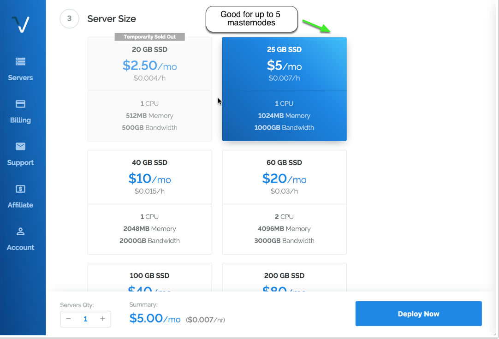

## Activating additional features (IPv6)

Multiple masternodes on one VPS require multiple IPv6 addresses. Toggle "Enable IPv6" to activate that feature for free (Vultr).

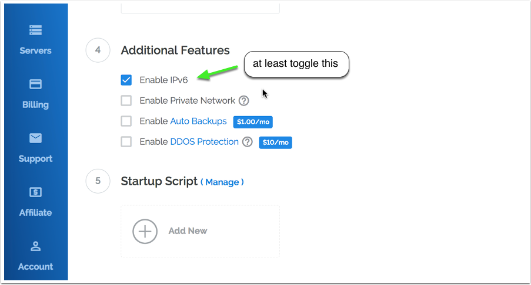


## Hostnames & number of VPS

Choose how many instances you want and click "Deploy Now".

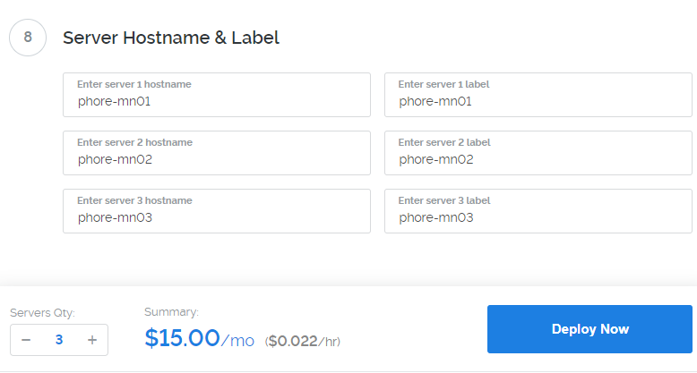

## Accessing your VPS via SSH

Copy access credentials for SSH access by opening the server details.

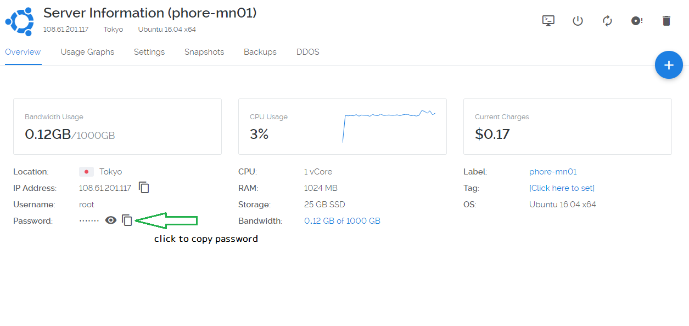

## First SSH session

Login to your newly installed node as "root".

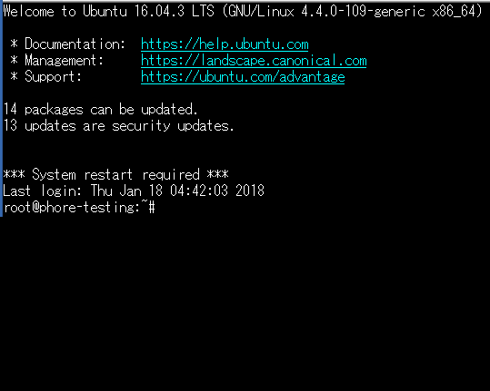

## Masternode script installation

Clone this git repository first:

```
git clone https://github.com/masternodes/vps.git && cd vps
```


## Install the desired masternode and amount

Use the *./install.sh* script with the desired crypto and masternode count as parameters, e.g. to install 4 PIVX masternodes:

```
./install.sh -p pivx -c 4
```

The script downloads, compiles and configures the system now. This will usually take between 5-15 minutes.

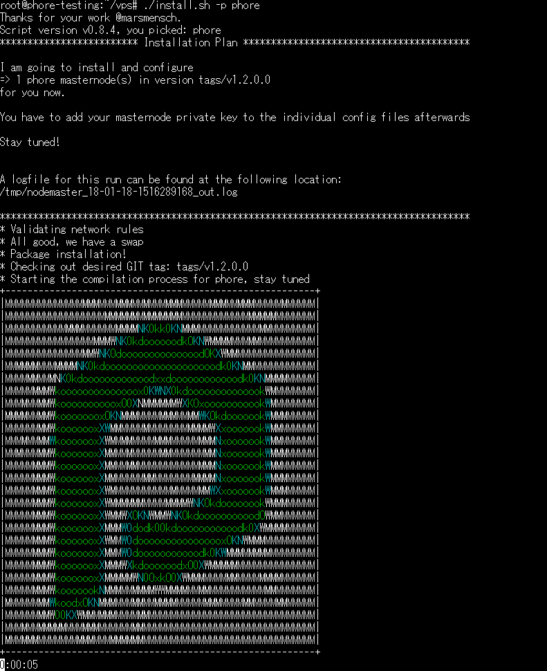

The *./install.sh* script outputs a list of possible parameters if executed without options.

## End of installation

The script will output lots of boring stuff and it's ascii banner when done. Your only real work begins now.

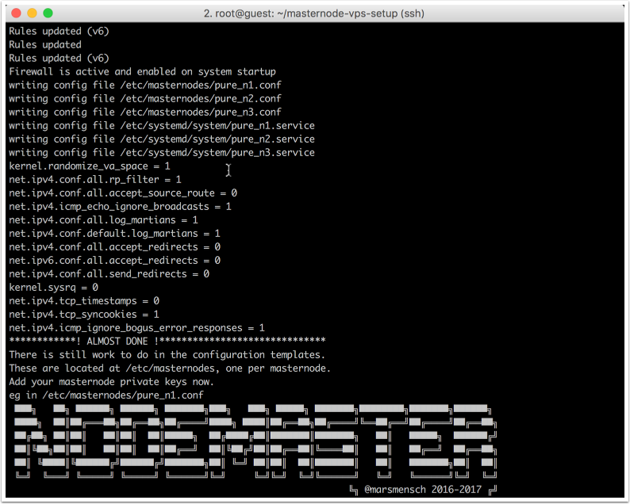


## Masternode configuration files

The generated configuration files are located at /etc/masternodes/. One file per masternode and crypto.

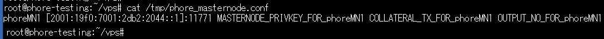


## Insert your masternode private key

In 99% you can use the generated settings as is. The only value you MUST change is the masternode private key, generated in your controller wallet. Contact the individual crypto community if unsure, although the steps are identical for most master node coins. Check the [Dash documentation for example](https://dashpay.atlassian.net/wiki/spaces/DOC/pages/1867877/Start+multiple+masternodes+from+one+wallet+start-many).

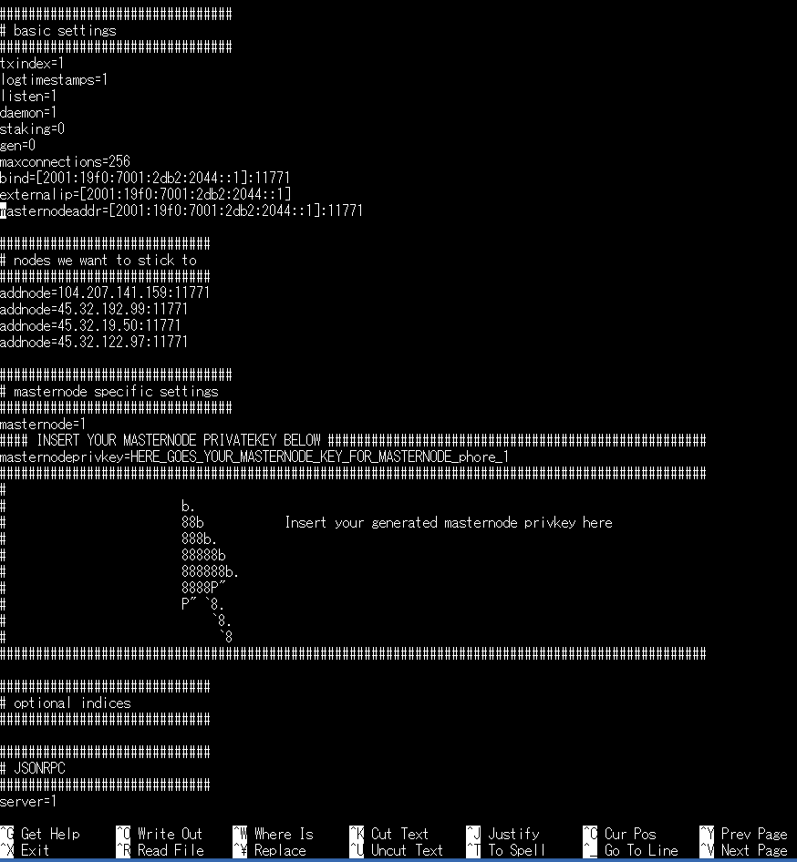


## Start your new masternodes

A script to enable masternode start at boot has been created at */usr/local/bin/activate_masternodes_${CODENAME}.sh* for your convenience. There is exactly one script per installed masternode crypto.

Run it after you finished configuration, e.g. after a PIVX installation do.

```
/usr/local/bin/activate_masternodes_pivx
```     

## Last step, the controller

To activate the new nodes in your _local_ (not the VPS) controller wallet, add the bind address entries with port to a file called "masternode.conf" as usual.

     MN1 [2002:470:1111:1a4:51]:51472 KEY TX OUTPUT
     MN2 [2003:470:1111:1a4:52]:51472 KEY TX OUTPUT
     MN3 [2003:470:1111:1a4:53]:51472 KEY TX OUTPUT

To make this a bit easier for large installations, i implemented a small gimmick in the newest version. Now after the script has run, a partial of the "masternode.conf" file is generated and placed on the VPS eg for XIOS at "/tmp/pivx_masternode.conf"

So you can take the contents from there and paste it into your local controller-wallets masternode.conf all that you need to add is the relevant pieces from "masternode outputs"

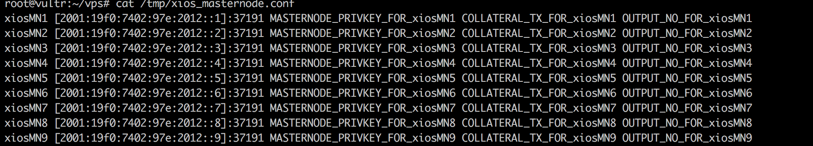

You get the idea, another step to a fully automated setup... ;-)

## Troubleshooting the masternode on the VPS

If you want to check the status of your masternode, the best way is currently running the cli e.g. via

```
/usr/local/bin/mue-cli -conf=/etc/masternodes/mue_n1.conf getinfo

{
  "version": 1000302,
  "protocolversion": 70701,
  "walletversion": 61000,
  "balance": 0.00000000,
  "privatesend_balance": 0.00000000,
  "blocks": 209481,
  "timeoffset": 0,
  "connections": 5,
  "proxy": "",
  "difficulty": 42882.54964804553,
  "testnet": false,
  "keypoololdest": 1511380627,
  "keypoolsize": 1001,
  "paytxfee": 0.00000000,
  "relayfee": 0.00010000,
  "errors": ""
}
```


# Issues and Questions

Please open github issue in case of questions or issues. I might not be able to reply immediately, but i do usually within a couple of days at worst.

If my scripts work for you, please send some crypto my way here:

**Have fun, this is crypto after all!**

    onate here:

<a href="https://gitcoin.co/tip/send/2/">
    
</a>

or send BTC to:

```
BTC  33ENWZ9RCYBG7nv6ac8KxBUSuQX64Hx3x3
```